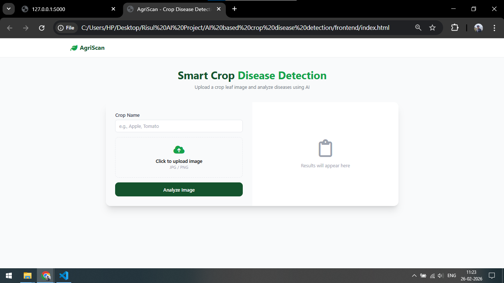
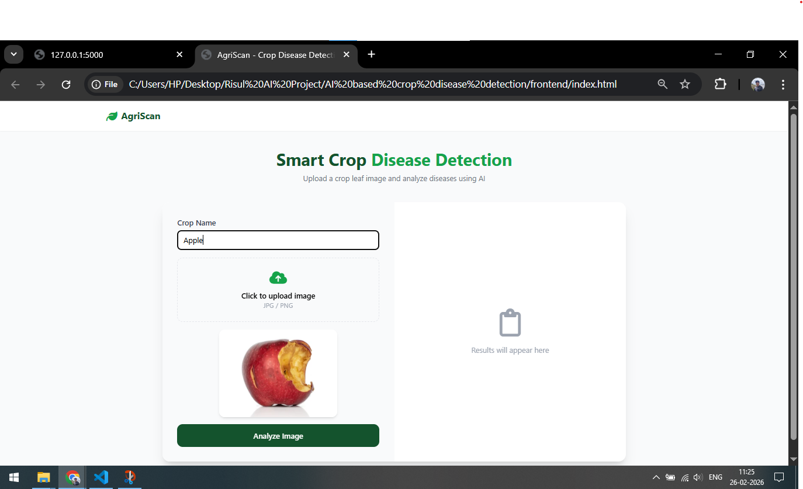
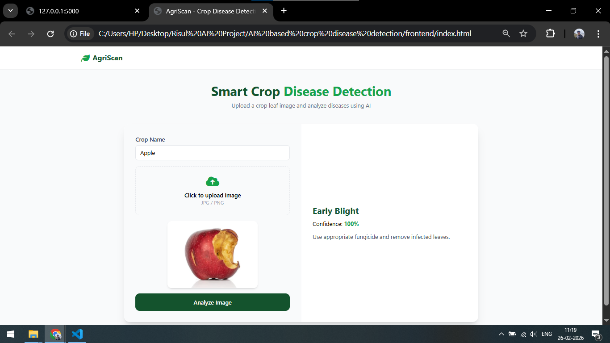

# 🌱 AgriScan AI – Intelligent Crop Disease Detection System

CropGuard AI is an end-to-end **AI-powered crop disease detection system** that analyzes leaf images to identify plant diseases, estimate confidence, and recommend treatments.  
The project integrates **Deep Learning**, a **Flask backend**, and a **modern web-based frontend** to deliver a complete and practical AI solution.

This system is designed for:
- Farmers
- Agricultural students
- Researchers
- Smart agriculture applications

---

## 📸 Project Screenshots

> 📌 Replace the image paths with your actual screenshots (recommended).

### Home Page


### Image Upload & Analysis


### AI Prediction Result


---

## 🎯 Project Objective

- Detect crop diseases from leaf images using AI
- Provide confidence score for predictions
- Recommend appropriate treatment actions
- Deliver results through a simple, user-friendly web interface

---

## 🧠 What This Project Has **Technically Inside**

### 🔹 1. Deep Learning Model
- A trained **Convolutional Neural Network (CNN)** model
- Learns visual patterns from leaf images
- Classifies diseases such as:
  - Early Blight
  - Late Blight
  - Healthy leaves
- Outputs:
  - Disease name
  - Confidence percentage

> Model files are excluded from GitHub due to size limitations.

---

### 🔹 2. Backend (Flask API)
The backend is responsible for:
- Receiving image and crop data
- Preprocessing images using OpenCV
- Loading the trained AI model
- Running predictions
- Sending structured JSON responses to frontend

**Key Backend Features**
- REST API using Flask
- `/analyze` endpoint for predictions
- Error handling and validation
- Modular service-based architecture

---

### 🔹 3. Image Processing Pipeline
- Image resizing and normalization
- Conversion to model-compatible format
- Ensures consistent prediction results

---

### 🔹 4. Recommendation System
- Maps detected diseases to:
  - Treatment steps
  - Preventive measures
- Displays actionable insights for users

---

## 🌐 What This Project Has **Outside (User-Facing)**

### 🔹 Frontend (Web Interface)
- Clean and modern UI
- Built using:
  - HTML
  - CSS
  - JavaScript
  - Tailwind CSS
- Features:
  - Crop name input
  - Image upload
  - Real-time AI analysis
  - Clear result visualization

---

### 🔹 User Interaction Flow
1. User enters crop name
2. User uploads leaf image
3. Clicks **Analyze Image**
4. AI processes the image
5. Results displayed:
   - Disease name
   - Confidence score
   - Treatment recommendation

---

## 🔁 System Architecture
User
│
│ (Image + Crop Name)
▼
Frontend (HTML/CSS/JS)
│
│ HTTP POST /analyze
▼
Flask Backend
│
│ Image Preprocessing
│ AI Model Prediction
│ Recommendation Mapping
▼
Prediction Response (JSON)
│
▼
Frontend UI (Results Display)


---

## 🛠️ Tech Stack

### Backend
- Python
- Flask
- TensorFlow / Keras
- OpenCV
- NumPy

### Frontend
- HTML
- CSS
- JavaScript
- Tailwind CSS

### Tools
- VS Code
- Git & GitHub

---

## 📂 Project Structure
│
├── backend/ # Flask app, AI logic, services
├── frontend/ # HTML, CSS, JavaScript UI
├── data/ # Dataset or sample structure
├── requirements.txt # Python dependencies
├── README.md # Documentation


---

## ⚙️ How to Run the Project

### 1️⃣ Clone the Repository
```bash
git clone https://github.com/<your-username>/<repo-name>.git
cd <repo-name>

2️⃣ Create Virtual Environment
python -m venv venv
venv\Scripts\activate   # Windows
3️⃣ Install Dependencies
pip install -r requirements.txt
4️⃣ Run the Backend
python -m backend.app

Backend runs at:

http://127.0.0.1:5000
5️⃣ Run the Frontend

Open:

frontend/index.html

in your browser.

🧪 How to Use

Enter crop name (e.g., Apple, Tomato)

Upload a clear leaf image

Click Analyze Image

View AI results and recommendations

📊 Dataset Information

Plant disease dataset with healthy and diseased leaf images

Multiple crop categories


Dataset not included due to size constraints

